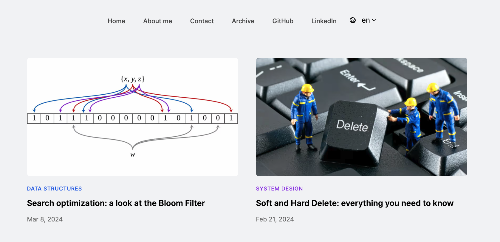

# Óscar Martínez

**`Software Engineer at Amazon`**

Hey there! 👋🏻

I'm Óscar Martínez, Software Engineer at Amazon. I'm focused on clean architectures and the development of
scalable, maintainable and testable code. Always learning about hexagonal architecture, event-driven architecture,
microservices, CQRS and so on.

---

### 👨🏻‍💻 Blog

<a href="https://oscmarb.com" target="_blank">oscmarb.com</a> is my blog where I talk about algorithms, data structures, clean architectures,
microservices, design patterns and much more!

